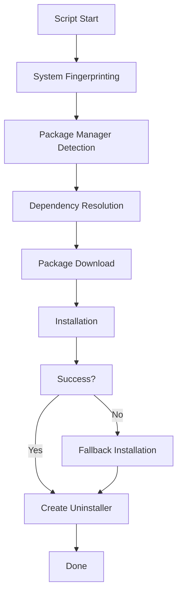

# 🚀 VS Code Insiders Cross-Distribution Linux Installer


## Overview

An intelligent, self-contained Bash script that automatically installs VS Code Insiders across virtually any Linux distribution with zero configuration. The script employs advanced system fingerprinting to detect your distribution, package manager, and dependencies, then executes the optimal installation strategy.

## 🔥 Features

- **Universal Compatibility**: Works across Debian, Ubuntu, Fedora, RHEL, CentOS, Arch, Manjaro, openSUSE, Alpine, Void, Gentoo and more
- **Intelligent System Detection**: Automatically identifies your distribution and package manager
- **Automatic Dependency Resolution**: Installs all required dependencies
- **Accelerated Downloads**: Uses aria2 when available for parallel downloads
- **Fallback Mechanisms**: Multiple installation methods with graceful degradation
- **Self-Documenting**: Comprehensive logging and progress display
- **Clean Uninstallation**: Generates a custom uninstaller script

## 📋 Prerequisites

- A Linux distribution (any modern distribution supported)
- Basic utilities (wget/curl, which the script will install if missing)
- Sudo privileges

## 🔧 Installation

### One-line installation

```bash
curl -sSL https://raw.githubusercontent.com/al-swaiti/vscode-insiders-linux/main/vscode-insiders-installer.sh | bash
```

### Download and run

```bash
# Download the script
wget https://raw.githubusercontent.com/al-swaiti/vscode-insiders-linux/main/vscode-insiders-installer.sh

# Make executable
chmod +x vscode-insiders-installer.sh

# Run the installer
./vscode-insiders-installer.sh
```

## 🛠️ Usage Options

The script supports several command-line options:

```
--debug      Enable detailed debug output
--update     Update the installer script to the latest version
--uninstall  Remove VS Code Insiders from your system
--help       Display usage information
```

## 🧠 AI Integration Benefits

VS Code Insiders includes cutting-edge AI features that transform your coding experience:

- **GitHub Copilot Integration**: Get intelligent code suggestions as you type
- **Multi-Model Support**: Leverage Claude 3.5 Sonnet, GPT-4o mini, Gemini 2 Flash for free
- **Contextual Help**: Get intelligent answers about your code directly inline
- **Command Generation**: Turn natural language into terminal commands
- **Code Explanations**: Understand complex code with AI-powered explanations

## 🔄 Installation Flow



## 🌟 Why VS Code Insiders?

- Access to cutting-edge features before they reach stable release
- Monthly updates with the latest improvements
- Enhanced AI integrations and code completion
- Better performance and stability improvements
- Early access to experimental features

## 🔍 Troubleshooting

If you encounter issues:

1. Run with `--debug` flag for detailed output
2. Check system requirements
3. Verify network connectivity
4. Ensure sudo privileges are available

## 🤝 Contributing

Contributions welcome! Please help test on different distributions and report any issues.

1. Fork the repository
2. Create your feature branch
3. Submit a pull request

## 📜 License

This project is licensed under the MIT License - see the LICENSE file for details.

---

Built with ❤️ by [al-swaiti](https://github.com/al-swaiti)
